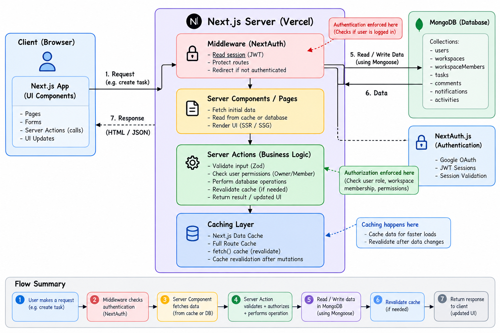

# TaskFlow

TaskFlow is a collaborative task management application for organizing work in
shared workspaces. Workspace owners can create and assign tasks, members can
track progress and collaborate with comments, and everyone can follow workspace
activity from a single dashboard.

## Features

- Register and sign in with email and password.
- Create workspaces and request to join existing workspaces.
- Manage workspace members and join requests.
- Create and assign tasks with priorities, due dates, and tags.
- Track task progress through **To Do**, **In Progress**, and **Done**.
- Move tasks between board columns with drag and drop.
- Search, filter, and sort workspace tasks.
- Add, edit, and delete comments with role-based permissions.
- View notifications and workspace activity history.
- View dashboard statistics and upcoming due dates.
- Update your profile and switch between light and dark themes.
- Soft-delete workspaces; inactive workspaces cannot be opened.

## Technology

- **Application:** Next.js App Router, React, TypeScript
- **UI:** Tailwind CSS, Lucide React, `next-themes`
- **Authentication:** Auth.js (NextAuth) credentials provider, `bcryptjs`
- **Data:** MongoDB with Mongoose
- **Validation:** Zod
- **Drag and drop:** `dnd-kit`
- **Tests:** Vitest

## Architecture



The application uses Next.js Server Components for server-rendered pages and
Server Actions for authenticated mutations. MongoDB access is handled through
Mongoose models. Authorization is checked on the server: for example, workspace
owners manage workspace settings and tasks, while workspace members can
collaborate on tasks they have access to.

## Getting started

### Requirements

- Node.js and npm
- A MongoDB database (MongoDB Atlas or a local MongoDB instance)

### Install and configure

1. Clone the repository and enter the application directory:

   ```bash
   git clone <repository-url>
   cd <repository-directory>/taskflow
   ```

2. Install dependencies:

   ```bash
   npm install
   ```

3. Create a local environment file from the example:

   ```bash
   cp .env.example .env.local
   ```

4. Set the values in `.env.local`:

   ```dotenv
   MONGODB_URI=mongodb+srv://<username>:<password>@<cluster>/<database>
   AUTH_SECRET=<a-long-random-secret>
   NEXTAUTH_URL=http://localhost:3000
   ```

   `MONGODB_URI` and `AUTH_SECRET` are required. Set `NEXTAUTH_URL` to the
   application’s public URL when deploying; for local development, use
   `http://localhost:3000`.

5. Start the development server:

   ```bash
   npm run dev
   ```

6. Open [http://localhost:3000](http://localhost:3000).

Keep `.env.local` private and never commit credentials or secrets.

## Available commands

| Command | Description |
| --- | --- |
| `npm run dev` | Start the Next.js development server |
| `npm run build` | Create a production build |
| `npm start` | Serve the production build |
| `npm run lint` | Run ESLint |
| `npm test` | Run unit and integration tests |
| `npx tsc --noEmit` | Run the TypeScript check |

The test suite currently includes unit tests for input validation and
integration tests for credential login, task creation, and comment submission.
The integration tests exercise the application actions with persistence
boundaries mocked; they do not require a running MongoDB instance.

## Main routes

| Route | Description |
| --- | --- |
| `/` | Public landing page |
| `/login` | Sign in |
| `/register` | Create an account |
| `/dashboard` | Dashboard and task overview |
| `/workspaces` | View workspaces you belong to |
| `/workspaces/create` | Create a workspace |
| `/workspaces/join` | Find workspaces and request membership |
| `/workspaces/[workspaceId]` | Workspace overview |
| `/workspaces/[workspaceId]/board` | Workspace Kanban board |
| `/workspaces/[workspaceId]/tasks` | Search, filter, and manage workspace tasks |
| `/workspaces/[workspaceId]/members` | Workspace members |
| `/workspaces/[workspaceId]/activity` | Workspace activity history |
| `/workspaces/[workspaceId]/settings` | Workspace settings |

## Deployment

Deploy the application to a Next.js-compatible platform, such as Vercel. Set
`MONGODB_URI` and `AUTH_SECRET` in the deployment environment, and configure
`NEXTAUTH_URL` to the deployed application URL. No public deployment URL is
listed here yet.

## Current limitations

- Notifications are stored in MongoDB and are not delivered over WebSockets.
- Activity history records supported actions from when tracking is enabled; it
  does not backfill events that occurred before activity records were added.
- Task search, filtering, and sorting run in the browser after workspace tasks
  are loaded. Very large workspaces may benefit from server-side pagination.
- Drag-and-drop changes are persisted by the server, but updates are not
  broadcast live to other users.
- Real-time presence and collaboration indicators are not implemented.
